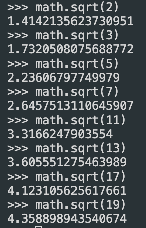
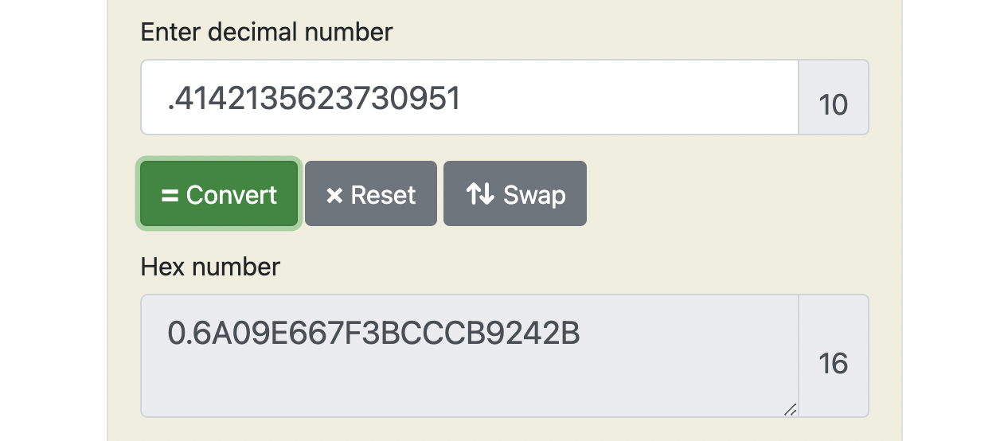

# SHA-256


`Repository for Implemented SHA256 Hashing algorithm from scratch. `

### What is SHA256?

SHA256 or SHA II is an Cryptographic Hashing Function.

It takes inputs of any size and would give an unique output of 256 bits or 32 bytes.

Assume it to be function which takes and input and provides a unique output for your input, the fun part is hash output cannot be used to get back Hash functions inout value.

 So it is like a one way function and you cannot go back and find the input from the output but you can always create the output.

### What is Hash Collision?

The input size of an Hash function can be infinite but the output size is always limited hence we will always get some same values for for multiple different input values. This event is called collision as multiple input values collide to return the same output values.

Although collision is almost impossible and very low probability event but it is still possible.

## Internal Working

The internal working has been explained from : [SHA-256 blog](https://blog.boot.dev/cryptography/how-sha-2-works-step-by-step-sha-256/)

and I am glad to have found such an amazing blog.

I have explained the blog in my words for my understanding

### **Pre-Processing**

Assuming we are using `"hello world"` as input text which is of length 11 bytes.

one byte is 8 bits.

1. So we convert the input text int binary as our first step.

   ```
   01101000 01100101 01101100 01101100 01101111 00100000 01110111 01101111
   01110010 01101100 01100100
   ```
2. Now we append 1 followed by zeroes to this binary string

   ```
   01101000 01100101 01101100 01101100 01101111 00100000 01110111 01101111
   01110010 01101100 01100100 10000000 00000000 00000000 00000000 00000000
   00000000 00000000 00000000 00000000 00000000 00000000 00000000 00000000
   00000000 00000000 00000000 00000000 00000000 00000000 00000000 00000000
   00000000 00000000 00000000 00000000 00000000 00000000 00000000 00000000
   00000000 00000000 00000000 00000000 00000000 00000000 00000000 00000000
   00000000 00000000 00000000 00000000 00000000 00000000 00000000 00000000
   ```

   untill we form block of 448 bits.
3. In the last we append length of original text in binary which is 88 bits in binary to the prev binary string in big endian format which is like msb on right format

   ```
   01101000 01100101 01101100 01101100 01101111 00100000 01110111 01101111
   01110010 01101100 01100100 10000000 00000000 00000000 00000000 00000000
   00000000 00000000 00000000 00000000 00000000 00000000 00000000 00000000
   00000000 00000000 00000000 00000000 00000000 00000000 00000000 00000000
   00000000 00000000 00000000 00000000 00000000 00000000 00000000 00000000
   00000000 00000000 00000000 00000000 00000000 00000000 00000000 00000000
   00000000 00000000 00000000 00000000 00000000 00000000 00000000 00000000
   00000000 00000000 00000000 00000000 00000000 00000000 00000000 01011000
   ```
4. 
5. Now we have an Input divisible by 512.

   ### Initializing Hash Value(H)

   We then create 8 hash values which are hardcoded constants which represent first 4 bytes or 32 bits of fractional parts of square roots of first 8 primes

   `2,3,5,7,11,13,17,19`

   

   for example we take decimal values of root 2 and cobert it to hex and we take the first 4 bytes from there which are 0x6a09e667
   similarly we take the rest 6 values as shown below:


   ```
   h0 := 0x6a09e667
   h1 := 0xbb67ae85
   h2 := 0x3c6ef372
   h3 := 0xa54ff53a
   h4 := 0x510e527f
   h5 := 0x9b05688c
   h6 := 0x1f83d9ab
   h7 := 0x5be0cd19
   ```

   ### Initializing Round Constants(K)

   Now we create 64 round constants and each is derived from first 32 bites or 4bytes of fractioonal parts of cube root of first 64 primes[2-311]

   ```
   0x428a2f98 0x71374491 0xb5c0fbcf 0xe9b5dba5 0x3956c25b 0x59f111f1 0x923f82a4 0xab1c5ed5
   0xd807aa98 0x12835b01 0x243185be 0x550c7dc3 0x72be5d74 0x80deb1fe 0x9bdc06a7 0xc19bf174
   0xe49b69c1 0xefbe4786 0x0fc19dc6 0x240ca1cc 0x2de92c6f 0x4a7484aa 0x5cb0a9dc 0x76f988da
   0x983e5152 0xa831c66d 0xb00327c8 0xbf597fc7 0xc6e00bf3 0xd5a79147 0x06ca6351 0x14292967
   0x27b70a85 0x2e1b2138 0x4d2c6dfc 0x53380d13 0x650a7354 0x766a0abb 0x81c2c92e 0x92722c85
   0xa2bfe8a1 0xa81a664b 0xc24b8b70 0xc76c51a3 0xd192e819 0xd6990624 0xf40e3585 0x106aa070
   0x19a4c116 0x1e376c08 0x2748774c 0x34b0bcb5 0x391c0cb3 0x4ed8aa4a 0x5b9cca4f 0x682e6ff3
   0x748f82ee 0x78a5636f 0x84c87814 0x8cc70208 0x90befffa 0xa4506ceb 0xbef9a3f7 0xc67178f2
   ```

   ### Chunk Loop

   The subsequent steps will happen in every 512 bit chunk from our input

   for the initial case the input was small so we needed to pad it otherwise we would have taken 512 bit chunks directly there.

   In each iteration of this loop we would be modifying the hash values h0 to h7 which will be the final output.

   If you notice each h value is 32 bits and we have 8 values so appending them together in the end we get 256 bits or 32 bytes hash digest .(just some futuristic observation you should make rn)

   ### Create Message Schedule(W)

   We then the create a new array from our input where each entry is a 32bit or 8 byte word.

   Its better to visually see it for me so here we go
   first I will show input and the input formatted in a different way as words

   ```
   01101000 01100101 01101100 01101100 01101111 00100000 01110111 01101111
   01110010 01101100 01100100 10000000 00000000 00000000 00000000 00000000
   00000000 00000000 00000000 00000000 00000000 00000000 00000000 00000000
   00000000 00000000 00000000 00000000 00000000 00000000 00000000 00000000
   00000000 00000000 00000000 00000000 00000000 00000000 00000000 00000000
   00000000 00000000 00000000 00000000 00000000 00000000 00000000 00000000
   00000000 00000000 00000000 00000000 00000000 00000000 00000000 00000000
   00000000 00000000 00000000 00000000 00000000 00000000 00000000 01011000
   ```

   ```
   01101000011001010110110001101100 01101111001000000111011101101111
   01110010011011000110010010000000 00000000000000000000000000000000
   00000000000000000000000000000000 00000000000000000000000000000000
   00000000000000000000000000000000 00000000000000000000000000000000
   00000000000000000000000000000000 00000000000000000000000000000000
   00000000000000000000000000000000 00000000000000000000000000000000
   00000000000000000000000000000000 00000000000000000000000000000000
   00000000000000000000000000000000 00000000000000000000000001011000
   ```

   So we have 16 words in array here.

We then add 48 more words to this array to get 64 words ,the new appended words will be all zeros.

```
01101000011001010110110001101100 01101111001000000111011101101111
01110010011011000110010010000000 00000000000000000000000000000000
00000000000000000000000000000000 00000000000000000000000000000000
00000000000000000000000000000000 00000000000000000000000000000000
00000000000000000000000000000000 00000000000000000000000000000000
00000000000000000000000000000000 00000000000000000000000000000000
00000000000000000000000000000000 00000000000000000000000000000000
00000000000000000000000000000000 00000000000000000000000001011000
00000000000000000000000000000000 00000000000000000000000000000000
00000000000000000000000000000000 00000000000000000000000000000000
00000000000000000000000000000000 00000000000000000000000000000000
00000000000000000000000000000000 00000000000000000000000000000000
...
...
00000000000000000000000000000000 00000000000000000000000000000000
```

Now we are required to modify the newly appended 32 bit elements which are zeroes with the following algorithm:

Our input block will be 16 elements in the new array

we then simply just iterate over values from 16 to 63

    and calculate 2 arrays as follows:

* For **i** from w[16…63]:
  * s0 = (w[i-15] rightrotate 7) xor (w[i-15] rightrotate 18) xor (w[i-15] rightshift 3)
  * s1 = (w[i- 2] rightrotate 17) xor (w[i- 2] rightrotate 19) xor (w[i- 2] rightshift 10)
  * w[i] = w[i-16] + s0 + w[i-7] + s1

    Example of i=16 is as follows:

```
w[1] rightrotate 7:
  01101111001000000111011101101111 -> 11011110110111100100000011101110
w[1] rightrotate 18:
  01101111001000000111011101101111 -> 00011101110110111101101111001000
w[1] rightshift 3:
  01101111001000000111011101101111 -> 00001101111001000000111011101101

s0 = 11011110110111100100000011101110 XOR 00011101110110111101101111001000 XOR 00001101111001000000111011101101

s0 = 11001110111000011001010111001011

w[14] rightrotate 17:
  00000000000000000000000000000000 -> 00000000000000000000000000000000
w[14] rightrotate19:
  00000000000000000000000000000000 -> 00000000000000000000000000000000
w[14] rightshift 10:
  00000000000000000000000000000000 -> 00000000000000000000000000000000

s1 = 00000000000000000000000000000000 XOR 00000000000000000000000000000000 XOR 00000000000000000000000000000000

s1 = 00000000000000000000000000000000

w[16] = w[0] + s0 + w[9] + s1

w[16] = 01101000011001010110110001101100 + 11001110111000011001010111001011 + 00000000000000000000000000000000 + 00000000000000000000000000000000

// addition is calculated modulo 2^32

w[16] = 00110111010001110000001000110111
```

The scheduled message is then as follows:

```


01101000011001010110110001101100 01101111001000000111011101101111
01110010011011000110010010000000 00000000000000000000000000000000
00000000000000000000000000000000 00000000000000000000000000000000
00000000000000000000000000000000 00000000000000000000000000000000
00000000000000000000000000000000 00000000000000000000000000000000
00000000000000000000000000000000 00000000000000000000000000000000
00000000000000000000000000000000 00000000000000000000000000000000
00000000000000000000000000000000 00000000000000000000000001011000
00110111010001110000001000110111 10000110110100001100000000110001
11010011101111010001000100001011 01111000001111110100011110000010
00101010100100000111110011101101 01001011001011110111110011001001
00110001111000011001010001011101 10001001001101100100100101100100
01111111011110100000011011011010 11000001011110011010100100111010
10111011111010001111011001010101 00001100000110101110001111100110
10110000111111100000110101111101 01011111011011100101010110010011
00000000100010011001101101010010 00000111111100011100101010010100
00111011010111111110010111010110 01101000011001010110001011100110
11001000010011100000101010011110 00000110101011111001101100100101
10010010111011110110010011010111 01100011111110010101111001011010
11100011000101100110011111010111 10000100001110111101111000010110
11101110111011001010100001011011 10100000010011111111001000100001
11111001000110001010110110111000 00010100101010001001001000011001
00010000100001000101001100011101 01100000100100111110000011001101
10000011000000110101111111101001 11010101101011100111100100111000
00111001001111110000010110101101 11111011010010110001101111101111
11101011011101011111111100101001 01101010001101101001010100110100
00100010111111001001110011011000 10101001011101000000110100101011
01100000110011110011100010000101 11000100101011001001100000111010
00010001010000101111110110101101 10110000101100000001110111011001
10011000111100001100001101101111 01110010000101111011100000011110
10100010110101000110011110011010 00000001000011111001100101111011
11111100000101110100111100001010 11000010110000101110101100010110
```

Addition is done like we add all the 4 arrays and then to avoid overflows we mod the result of the final addition with 2^32.

which is simply asked to do addition using mod 2 ^32.

basically we are rolling back to values in circular fashion and preventing overflows.

### Compression

Initialize variables a,b,c,d,e,f,g,h and map them to hash constants h0 to h7

Now the compression loop with modify the values of a to h

The following is the compression loop:

    All addition here is done using addition mod 2^32

* for i from 0 to 63
  * S1 = (e rightrotate 6) xor (e rightrotate 11) xor (e rightrotate 25)
  * ch = (e and f) xor ((not e) and g)
  * temp1 = h + S1 + ch + k[i] + w[i]
  * S0 = (a rightrotate 2) xor (a rightrotate 13) xor (a rightrotate 22)
  * maj = (a and b) xor (a and c) xor (b and c)
  * temp2 := S0 + maj
  * h = g
  * g = f
  * f = e
  * e = d + temp1
  * d = c
  * c = b
  * b = a
  * a = temp1 + temp2

```
a = 0x6a09e667 = 01101010000010011110011001100111
b = 0xbb67ae85 = 10111011011001111010111010000101
c = 0x3c6ef372 = 00111100011011101111001101110010
d = 0xa54ff53a = 10100101010011111111010100111010
e = 0x510e527f = 01010001000011100101001001111111
f = 0x9b05688c = 10011011000001010110100010001100
g = 0x1f83d9ab = 00011111100000111101100110101011
h = 0x5be0cd19 = 01011011111000001100110100011001

e rightrotate 6:
  01010001000011100101001001111111 -> 11111101010001000011100101001001
e rightrotate 11:
  01010001000011100101001001111111 -> 01001111111010100010000111001010
e rightrotate 25:
  01010001000011100101001001111111 -> 10000111001010010011111110101000
S1 = 11111101010001000011100101001001 XOR 01001111111010100010000111001010 XOR 10000111001010010011111110101000
S1 = 00110101100001110010011100101011

e and f:
    01010001000011100101001001111111
  & 10011011000001010110100010001100 =
    00010001000001000100000000001100
not e:
  01010001000011100101001001111111 -> 10101110111100011010110110000000
(not e) and g:
    10101110111100011010110110000000
  & 00011111100000111101100110101011 =
    00001110100000011000100110000000
ch = (e and f) xor ((not e) and g)
   = 00010001000001000100000000001100 xor 00001110100000011000100110000000
   = 00011111100001011100100110001100

// k[i] is the round constant
// w[i] is the batch
temp1 = h + S1 + ch + k[i] + w[i]
temp1 = 01011011111000001100110100011001 + 00110101100001110010011100101011 + 00011111100001011100100110001100 + 01000010100010100010111110011000 + 01101000011001010110110001101100
temp1 = 01011011110111010101100111010100

a rightrotate 2:
  01101010000010011110011001100111 -> 11011010100000100111100110011001
a rightrotate 13:
  01101010000010011110011001100111 -> 00110011001110110101000001001111
a rightrotate 22:
  01101010000010011110011001100111 -> 00100111100110011001110110101000
S0 = 11011010100000100111100110011001 XOR 00110011001110110101000001001111 XOR 00100111100110011001110110101000
S0 = 11001110001000001011010001111110

a and b:
    01101010000010011110011001100111
  & 10111011011001111010111010000101 =
    00101010000000011010011000000101
a and c:
    01101010000010011110011001100111
  & 00111100011011101111001101110010 =
    00101000000010001110001001100010
b and c:
    10111011011001111010111010000101
  & 00111100011011101111001101110010 =
    00111000011001101010001000000000
maj = (a and b) xor (a and c) xor (b and c)
    = 00101010000000011010011000000101 xor 00101000000010001110001001100010 xor 00111000011001101010001000000000 
    = 00111010011011111110011001100111

temp2 = S0 + maj
      = 11001110001000001011010001111110 + 00111010011011111110011001100111
      = 00001000100100001001101011100101

h = 00011111100000111101100110101011
g = 10011011000001010110100010001100
f = 01010001000011100101001001111111
e = 10100101010011111111010100111010 + 01011011110111010101100111010100
  = 00000001001011010100111100001110
d = 00111100011011101111001101110010
c = 10111011011001111010111010000101
b = 01101010000010011110011001100111
a = 01011011110111010101100111010100 + 00001000100100001001101011100101
  = 01100100011011011111010010111001
```

NOTE: we would do the entire Caculation 63 more times and modify the constants multiple time.

### Modifying Final Values


After the compression loop, but still, within the *chunk* loop, we modify the hash values by adding their respective variables to them, a-h. As usual, all addition is modulo 2^32.

```
h0 = h0 + a = 10111001010011010010011110111001
h1 = h1 + b = 10010011010011010011111000001000
h2 = h2 + c = 10100101001011100101001011010111
h3 = h3 + d = 11011010011111011010101111111010
h4 = h4 + e = 11000100100001001110111111100011
h5 = h5 + f = 01111010010100111000000011101110
h6 = h6 + g = 10010000100010001111011110101100
h7 = h7 + h = 11100010111011111100110111101001
```


### Concatenate the Final Hash Values to get Hash Digest

Simply append hash constants to get the final hash digest:

```
digest = h0 append h1 append h2 append h3 append h4 append h5 append h6 append h7
       = B94D27B9934D3E08A52E52D7DA7DABFAC484EFE37A5380EE9088F7ACE2EFCDE9
```


### PseudoCode

The repository has actual code but just in case you are cool enough to get it done yourself, here you go:

```
Note 1: All variables are 32 bit unsigned integers and addition is calculated modulo 232
Note 2: For each round, there is one round constant k[i] and one entry in the message schedule array w[i], 0 ≤ i ≤ 63
Note 3: The compression function uses 8 working variables, a through h
Note 4: Big-endian convention is used when expressing the constants in this pseudocode,
    and when parsing message block data from bytes to words, for example,
    the first word of the input message "abc" after padding is 0x61626380

Initialize hash values:
(first 32 bits of the fractional parts of the square roots of the first 8 primes 2..19):
h0 := 0x6a09e667
h1 := 0xbb67ae85
h2 := 0x3c6ef372
h3 := 0xa54ff53a
h4 := 0x510e527f
h5 := 0x9b05688c
h6 := 0x1f83d9ab
h7 := 0x5be0cd19

Initialize array of round constants:
(first 32 bits of the fractional parts of the cube roots of the first 64 primes 2..311):
k[0..63] :=
   0x428a2f98, 0x71374491, 0xb5c0fbcf, 0xe9b5dba5, 0x3956c25b, 0x59f111f1, 0x923f82a4, 0xab1c5ed5,
   0xd807aa98, 0x12835b01, 0x243185be, 0x550c7dc3, 0x72be5d74, 0x80deb1fe, 0x9bdc06a7, 0xc19bf174,
   0xe49b69c1, 0xefbe4786, 0x0fc19dc6, 0x240ca1cc, 0x2de92c6f, 0x4a7484aa, 0x5cb0a9dc, 0x76f988da,
   0x983e5152, 0xa831c66d, 0xb00327c8, 0xbf597fc7, 0xc6e00bf3, 0xd5a79147, 0x06ca6351, 0x14292967,
   0x27b70a85, 0x2e1b2138, 0x4d2c6dfc, 0x53380d13, 0x650a7354, 0x766a0abb, 0x81c2c92e, 0x92722c85,
   0xa2bfe8a1, 0xa81a664b, 0xc24b8b70, 0xc76c51a3, 0xd192e819, 0xd6990624, 0xf40e3585, 0x106aa070,
   0x19a4c116, 0x1e376c08, 0x2748774c, 0x34b0bcb5, 0x391c0cb3, 0x4ed8aa4a, 0x5b9cca4f, 0x682e6ff3,
   0x748f82ee, 0x78a5636f, 0x84c87814, 0x8cc70208, 0x90befffa, 0xa4506ceb, 0xbef9a3f7, 0xc67178f2

Pre-processing (Padding):
begin with the original message of length L bits
append a single '1' bit
append K '0' bits, where K is the minimum number >= 0 such that L + 1 + K + 64 is a multiple of 512
append L as a 64-bit big-endian integer, making the total post-processed length a multiple of 512 bits

Process the message in successive 512-bit chunks:
break message into 512-bit chunks
for each chunk
    create a 64-entry message schedule array w[0..63] of 32-bit words
    (The initial values in w[0..63] don't matter, so many implementations zero them here)
    copy chunk into first 16 words w[0..15] of the message schedule array

    Extend the first 16 words into the remaining 48 words w[16..63] of the message schedule array:
    for i from 16 to 63
        s0 := (w[i-15] rightrotate  7) xor (w[i-15] rightrotate 18) xor (w[i-15] rightshift  3)
        s1 := (w[i- 2] rightrotate 17) xor (w[i- 2] rightrotate 19) xor (w[i- 2] rightshift 10)
        w[i] := w[i-16] + s0 + w[i-7] + s1

    Initialize working variables to current hash value:
    a := h0
    b := h1
    c := h2
    d := h3
    e := h4
    f := h5
    g := h6
    h := h7

    Compression function main loop:
    for i from 0 to 63
        S1 := (e rightrotate 6) xor (e rightrotate 11) xor (e rightrotate 25)
        ch := (e and f) xor ((not e) and g)
        temp1 := h + S1 + ch + k[i] + w[i]
        S0 := (a rightrotate 2) xor (a rightrotate 13) xor (a rightrotate 22)
        maj := (a and b) xor (a and c) xor (b and c)
        temp2 := S0 + maj
 
        h := g
        g := f
        f := e
        e := d + temp1
        d := c
        c := b
        b := a
        a := temp1 + temp2

    Add the compressed chunk to the current hash value:
    h0 := h0 + a
    h1 := h1 + b
    h2 := h2 + c
    h3 := h3 + d
    h4 := h4 + e
    h5 := h5 + f
    h6 := h6 + g
    h7 := h7 + h

Produce the final hash value (big-endian):
digest := hash := h0 append h1 append h2 append h3 append h4 append h5 append h6 append h7
```
